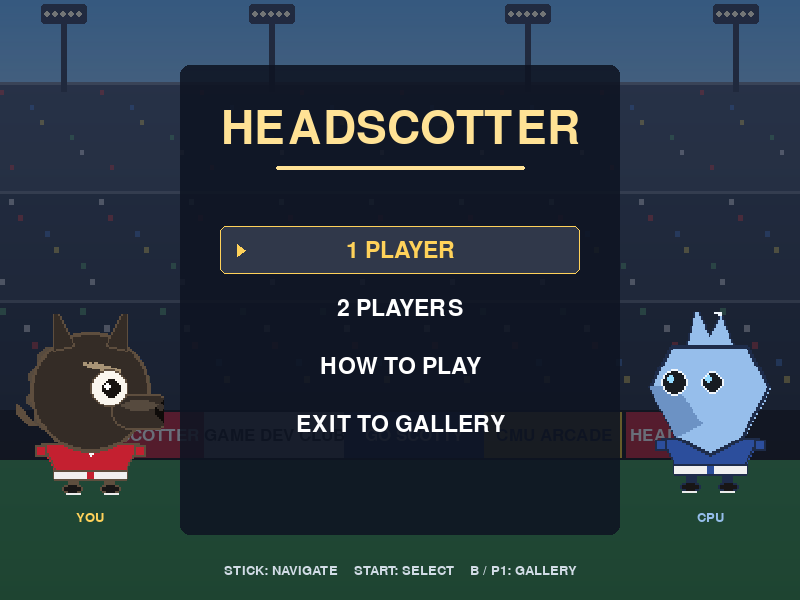
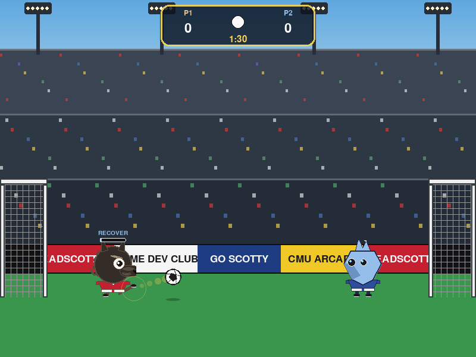
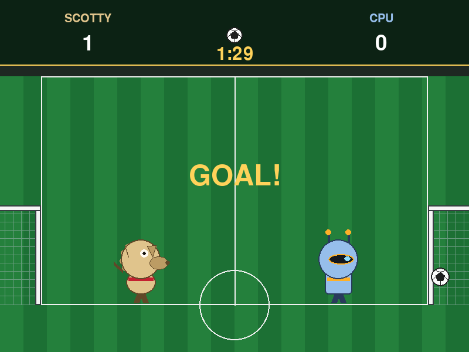
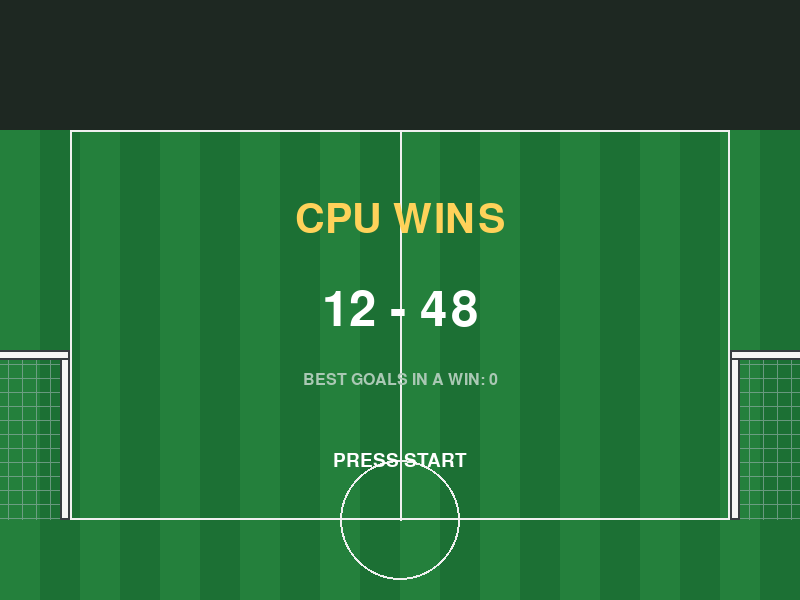

# HeadScotter

An original head-soccer arcade game starring **Scotty**, the CMU
mascot, and a rival opponent, built for the CMU-Q arcade cabinet and its
[ArcadeLauncher](https://github.com/GDC-CMU/ArcadeLauncher).

Head soccer is a genre; this project's art, characters, name, and layout
are original and don't reproduce any specific commercial game.



## What it is

- A real, navigable **main menu** (1 Player / 2 Players / How to Play /
  Exit to Gallery), not just a "press start" splash.
- **1 Player** (versus a CPU opponent) and **2 Players** (head to head)
  modes, chosen from the menu.
- A **90-second match**, most goals wins, **sudden death** (next goal
  wins) if the score is tied at full time.
- Two action buttons at most -- jump and kick -- so a first-time visitor
  understands it in three seconds.
- A **beatable but not passive** CPU opponent: it tracks the ball, jumps
  when it's overhead, kicks when it's in range, and has a small,
  human-like reaction lag rather than frame-perfect tracking.
- A self-playing **attract-mode demo** (CPU vs CPU, using the real
  match/physics/AI systems) after 15 seconds of idling on the menu.
- **All gameplay art is swappable PNGs** -- see
  [`assets/README.md`](assets/README.md).







## Controls

### Arcade cabinet

Two identical joysticks are wired to the cabinet. In **1 Player**, either
stick controls the human; in **2 Players**, stick 1 (device index 0)
controls the left player and stick 2 (device index 1) controls the
right player.

| Input | Action |
|---|---|
| Joystick axis 0 (left/right) | Move |
| Button 1 (A) | Jump (also: confirm/select on menus) |
| Button 2 (X) | Kick |
| Button 5 (P1) | Back one level (match/menu -> main menu -> exit to gallery) |

### Keyboard (development)

| Player | Move | Jump | Kick |
|---|---|---|---|
| 1 | `A` / `D` | `W` | `S` |
| 2 | Left / Right arrows | Up arrow | Down arrow |

`Enter`/`Space` confirm menu selections; `Esc`/`Backspace` are aliases
for the back button above.

Run windowed during development with:

```
$env:HEADSCOTTER_WINDOWED = "1"   # PowerShell
python main.py
```

## Architecture

Pure game logic is fully separated from rendering, so it's unit-testable
without a display:

```
main.py                  entrypoint at repo root
headscotter/
  config.py              every tunable constant (physics, timing, input, layout)
  physics.py              ball gravity/bounce/collision -- no pygame import
  players.py              player movement, jump, kick -- no pygame import
  cpu.py                   the 1P opponent's AI -- no pygame import
  match.py                 clock, scoring, sudden death, high-score file -- no pygame import
  input.py                 two joysticks + keyboard -> game actions -- no pygame import
  game.py                  the state machine (only pygame-touching module besides render/assets)
  assets.py                the single point of PNG access
  render.py                draws only from assets.py surfaces
tools/generate_placeholders.py   regenerates the committed placeholder art deterministically
tools/generate_preview.py        regenerates the ArcadeLauncher gallery-card preview loop
tests/                    headless unit tests (SDL_VIDEODRIVER=dummy)
assets/                   sprites + assets/README.md (the art-swap contract)
assets/preview/           gallery attract-mode preview loop (see below)
docs/screenshots/         what it currently looks like
```

`config.py`, `physics.py`, `players.py`, `cpu.py`, `match.py`, and
`input.py` never import pygame -- enforced by
`tests/test_layering.py` -- so the ball physics, match rules, CPU
behaviour, and input resolution are all testable with plain `unittest`,
no display required.

## Tuning the physics

Every physics constant -- gravity, bounce restitution (ground/wall/head
separately), air drag, ground friction, kick impulse/angle/cooldown,
player speed/jump velocity, ball mass-ish tuning, and the CPU's reaction
delay/aim error -- is a named, commented constant in
`headscotter/config.py`. Nothing is hard-coded elsewhere. This is by
design: ball physics is the single thing most likely to need a
after-the-fact tuning pass once people are actually playing it on the
cabinet.

## Attract-mode preview (`assets/preview/`)

The ArcadeLauncher's gallery plays a short looping animation *inside this
game's card* while the cabinet idles -- it cannot run our own game loop
to produce that (it's a separate process), so we ship a small
pre-rendered clip instead. `assets/preview/manifest.json` lists an
ordered sequence of `frame_NNN.png` files (200x150, 8fps, ~1.75s loop)
played on repeat; see the launcher's own preview contract for the full
rules. This is entirely optional/read-only from the launcher's side --
the launcher never runs this repo's code to produce it.

The clip is generated, not hand-drawn: `tools/generate_preview.py` drives
the real attract-mode demo (the same CPU-vs-CPU match shown in-game after
15s idle) headlessly through the real render path, capturing a moment a
few seconds into the very first kickoff where the ball is already in
fast, open play. It is fully deterministic (fixed RNG seed, fixed
simulated timestep, no wall-clock or persisted state involved) -- running
it twice leaves `git status` clean. Regenerate after any art or physics
change that would make the loop stop matching how the game actually
plays:

```
python tools/generate_preview.py
```

## Development

```
pip install -r requirements.txt
python -m unittest discover -s tests -v      # headless, no display needed
python tools/generate_placeholders.py         # regenerate placeholder art
python tools/generate_preview.py              # regenerate the gallery preview loop
python main.py                                # run the game (HEADSCOTTER_WINDOWED=1 for a window)
```